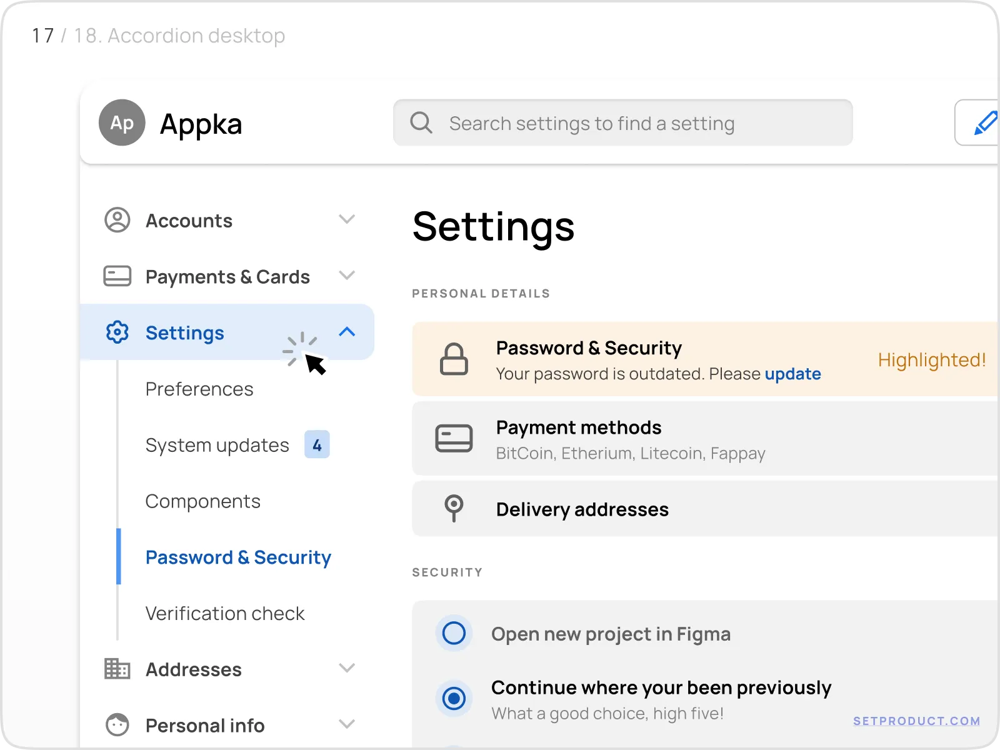

## Acordion

Accordion ist ein Interaktives UI-Element. Mit dem man Inhalte platzsparend strukturieren kann. Es zeigt mehrere Panels die auf oder zu geklappt werden können. So können gezielte Informationen angezeigt werden, ohne durch lange Text mengen zu scrollen müssen. Typische Einsatzbereiche sind FAQ Seiten, Produktdetails oder Hilfetexte. Accordeons verbessern die Übersichtlichkeit, fördern fokussiertes lesen und sind besonders nützlich auf Mobilengeräten, da sie Bildschirmplatz sparen.

### Alternativbegriffe:

* Aufklappbereich
* Expand/Collapse Panel
* Klappmenü

### Beispiel Bilder

